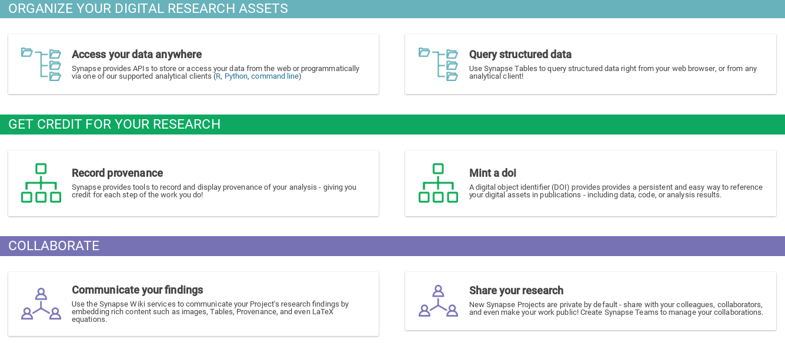

```{r setup, include=FALSE}
knitr::opts_chunk$set(echo = FALSE)
```

# Quiz!

## Open Science

How many people practice open science?

# What is Open Data/Science?

## FAIR

- Findable
- Accessible
- Interoperable
- Reproducible

Both for Humans and our Computer Overlords.

<div style="font-size: small">
Wilkinson, M. D. et al. The FAIR Guiding Principles for scientific data management and stewardship. Sci. Data 3:160018 doi: [10.1038/sdata.2016.18](http://dx.doi.org/0.1038/sdata.2016.18) (2016).
</div>

# Why Open and Reproducible?

## Why Open and Reproducible
- Easily allow other to build upon your work
- Increase transfer of knowledge
- Improve transparency, discourage fraudulent work
- The funding agency [tells you to](https://www.nlm.nih.gov/NIHbmic/nih_data_sharing_policies.html)
- Find collaborators 
- Get credit for it ([you](http://f1000research.com/articles?tab=ALL&articleTypes=DATA_NOTE) [can](http://www.nature.com/sdata) [publish](http://www.gigasciencejournal.com/) [it](http://www.mdpi.com/journal/data/about))

## Why (not) Open and Reproducible
- Risky for early-career researchers ([counterpoint](http://ivory.idyll.org/blog/2014-open-and-tenured.html))
- Publisher limitations
- [#researchparasites](https://twitter.com/search?q=%23researchparasites&src=typd) (NEJM 2016 http://dx.doi.org/10.1056/NEJMe1516564)
- I don't get credit
- Getting 'scooped' (that's plagarism! Use a [license](www.choosealicense.com))

# How Open and Reproducible?

## Getting started {.build}

Organizing analyses so that they are reproducible is not easy. It requires diligence and a considerable investment of time: to learn new computational tools, and to organize and document analyses as you go.

But **partially reproducible** is better than **not at all reproducible**. Just try to make your next paper or project better organized than the last.

1. Plan before you start
1. Organize and keep track of things
1. Archive and share

[Baby Steps for the Open Curious](https://practicaldatamanagement.wordpress.com/2014/10/23/baby-steps-for-the-open-curious/)

# Data Sharing Best Practices

## Data sharing | [click me!](http://kdaily.github.io/datasharing/pres.html)

Let's say you have some data (not necessarily big data) that you want to share.

These best practices work if whether you are sharing with a computational colleague or with a larger community.

## Review

- [Consistency](https://kdaily.github.io/dataorg/pages/consistency.html)
- [Plain text](https://kdaily.github.io/dataorg/pages/csv_files.html)
- [Make them rectangles](https://kdaily.github.io/dataorg/pages/rectangle.html)
- [Take care with dates](https://xkcd.com/1179/)
- [Data dictionary](https://kdaily.github.io/dataorg/pages/dictionary.html)
- [Share it and/or back it up - Synapse](https://www.synapse.org/)

## Sharing with [Synapse](https://www.synapse.org/) | We are:

1. **F**indable
1. **A**ccessible
1. **I**nteroperable
1. **R**eusable

Other things exist too [osf.io](www.osf.io), [Data Dryad](http://www.datadryad.org/), [Figshare](www.figshare.com)

## Sharing with [Synapse](https://www.synapse.org/)



## Sharing with [Synapse](https://www.synapse.org/) | We facilitate:

1. Data storage (free!)
1. Data sharing (private, public, or somewhere in between)
1. Documentation (Wikis)
1. Provenance (tracking steps to generate)
1. Attribution (I did something!)
1. Citation (DOIs)

<div style='font-size: small'>Other people provide these too.</div>